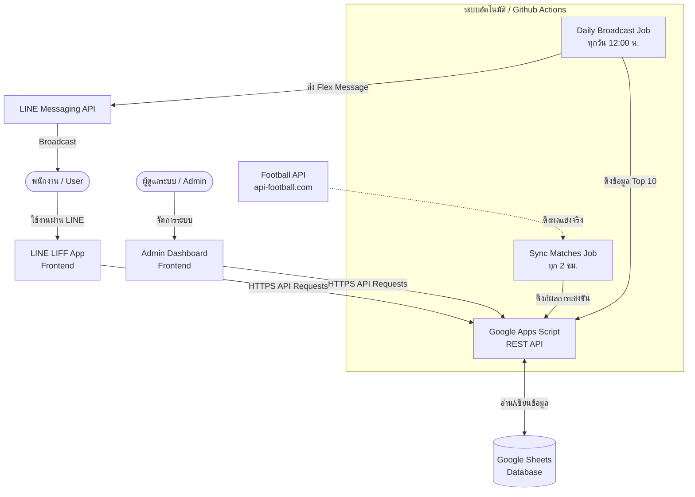

# 🏆 World Cup 2026 Prediction System
### ระบบทายผลฟุตบอลโลก 2026 สำหรับพนักงานผ่าน LINE OA & LIFF

ระบบนี้พัฒนาขึ้นเพื่อให้พนักงานในองค์กรสามารถร่วมสนุกทายผลการแข่งขันฟุตบอลโลก 2026 โดยมีระบบจัดอันดับคะแนน (Leaderboard) แบบเรียลไทม์ และระบบกระจายข่าวสารผ่าน LINE Official Account (OA) โดยใช้ **Google Sheets** เป็นฐานข้อมูลหลัก และมี **Google Apps Script (GAS)** ทำหน้าที่เป็น REST API หลังบ้าน

---

## 📌 สถาปัตยกรรมของระบบ (System Architecture)

ระบบประกอบด้วย 4 ส่วนหลักดังนี้:



1. **Frontend (สำหรับผู้ใช้)**: LINE Front-end Framework (LIFF) พัฒนาด้วย HTML, Vanilla CSS, และ JavaScript เชื่อมต่อกับ LINE OA ช่วยให้พนักงานล็อกอิน ทายผล และดูตารางคะแนนได้สะดวกผ่านมือถือ
2. **Backend API**: Google Apps Script (GAS) ทำหน้าที่รับ HTTP GET/POST requests จากหน้าต่าง ๆ เพื่อไปเขียน/อ่านข้อมูลใน Google Sheets และมีระบบคำนวณคะแนนของพนักงานหลังจบแมตช์อัตโนมัติ
3. **Database**: Google Sheets ทำหน้าที่เป็นฐานข้อมูลเก็บรายชื่อพนักงาน ตารางการแข่งขัน ผลการทายคะแนน และตารางอันดับ (Leaderboard)
4. **Admin Panel**: เว็บแอปพลิเคชันสำหรับผู้ดูแลระบบ เพื่อใช้รีเซ็ต PIN ของพนักงาน ดูข้อมูล และกรอกผลการแข่งขันกรณีเกิดข้อผิดพลาด (Override)
5. **Automation (GitHub Actions)**:
   - **Match Synchronization**: ดึงผลคะแนนการแข่งขันจริงจาก Football API และนำมาอัปเดตลง Google Sheets ทุก 2 ชั่วโมง
   - **Daily Broadcast**: ดึงข้อมูลอันดับตารางคะแนน Top 10 มาประกอบเป็น Flex Message และส่งข้อความ Broadcast ไปยังผู้ใช้งานทุกคนใน LINE OA ทุกวันเวลา 12:00 น. (เวลาไทย)

---

## 🗄️ โครงสร้างฐานข้อมูล (Database Schema)

สร้าง Google Sheets 1 ไฟล์ ประกอบไปด้วย 5 แผ่นงาน (Tabs) ดังนี้:

### 1. `User_Master` (ข้อมูลพนักงาน)
เก็บข้อมูลพนักงานที่มีสิทธิ์ร่วมกิจกรรม โดยแอดมินจะเป็นผู้นำข้อมูลมาใส่ไว้ล่วงหน้า ส่วนข้อมูล PIN และ LINE User ID จะถูกผูกเมื่อลงทะเบียนครั้งแรก
*   `Employee_ID` (Text, Primary Key): รหัสพนักงาน (เช่น EMP001)
*   `Full_Name` (Text): ชื่อ-นามสกุลพนักงาน
*   `User_PIN` (Text 4 หลัก): รหัสผ่านส่วนตัวสำหรับเข้าใช้งาน (ตั้งตอนลงทะเบียน)
*   `Line_User_ID` (Text): รหัส LINE User ID ของพนักงาน (ผูกให้อัตโนมัติเมื่อเริ่มใช้งานครั้งแรก)

### 2. `Matches` (ตารางและการแข่งขัน)
เก็บตารางการแข่งขัน ผลการแข่งขันจริง และข้อมูลการแก้ไขคะแนนโดยแอดมิน
*   `Match_ID` (Text, Primary Key): รหัสการแข่งขัน (เช่น WC01)
*   `Home_Team` (Text): ชื่อทีมเจ้าบ้าน
*   `Away_Team` (Text): ชื่อทีมเยือน
*   `Kickoff_Time` (ISO DateTime): วันเวลาเริ่มแข่งในรูปแบบ UTC (เช่น `2026-06-14T19:00:00Z`)
*   `Stage` (Text): รอบการแข่งขัน (`Group`, `Round of 16`, `Quarterfinals`, `Semifinals`, `Third place`, `Final`)
*   `Home_Score_Actual` (Number/Blank): ผลคะแนนจริงของทีมเหย้า (ซิงก์จาก Football API)
*   `Away_Score_Actual` (Number/Blank): ผลคะแนนจริงของทีมเยือน (ซิงก์จาก Football API)
*   `Qualified_Team_Actual` (Text/Blank): ทีมที่เข้ารอบจริง (สำหรับรอบน็อคเอาท์)
*   `Override_Home_Score` (Number/Blank): คะแนนทีมเหย้าที่แอดมินแก้ไขเอง
*   `Override_Away_Score` (Number/Blank): คะแนนทีมเยือนที่แอดมินแก้ไขเอง
*   `Override_Qualified_Team` (Text/Blank): ทีมที่เข้ารอบที่แอดมินแก้ไขเอง
*   `Status` (Text): สถานะการแข่งขัน (`Scheduled`, `Live`, `Finished`)

### 3. `Raw_Submissions` (ประวัติการทายผลแมตช์)
บันทึกประวัติการส่งคำทายของพนักงานทุกคน ระบบจะดึงแถวล่าสุดของคู่การแข่งขันนั้น ๆ มาคิดคะแนน
*   `Timestamp` (ISO DateTime): วันเวลาที่ส่งคำทาย
*   `Employee_ID` (Text): รหัสพนักงาน
*   `Match_ID` (Text): รหัสการแข่งขันที่ทายผล
*   `Home_Score_Predict` (Number): คะแนนทีมเหย้าที่ทาย
*   `Away_Score_Predict` (Number): คะแนนทีมเยือนที่ทาย
*   `Qualified_Team_Predict` (Text/Blank): ทีมที่ทายว่าจะเข้ารอบ (เฉพาะรอบน็อคเอาท์)

### 4. `Tournament_Winner_Submissions` (การทายผลแชมป์ทัวร์นาเมนต์)
บันทึกการทายผลทีมที่จะได้แชมป์บอลโลก 2026
*   `Timestamp` (ISO DateTime): วันเวลาที่ส่งคำทาย
*   `Employee_ID` (Text): รหัสพนักงาน
*   `Team_Predict` (Text): ชื่อทีมที่ทายว่าจะได้แชมป์

### 5. `Leaderboard` (ตารางอันดับสะสม)
ตารางคะแนนสำหรับแคชข้อมูลอันดับพนักงาน เพื่อให้ดึงไปแสดงผลได้อย่างรวดเร็ว
*   `Employee_ID` (Text, Primary Key): รหัสพนักงาน
*   `Full_Name` (Text): ชื่อ-นามสกุลพนักงาน
*   `Total_Points` (Number): คะแนนรวมสะสม
*   `Rank` (Number): อันดับสะสมของพนักงาน

---

## 📊 เกณฑ์การคำนวณคะแนน (Scoring Logic)

เมื่อการแข่งขันแต่ละแมตช์จบลง หรือแอดมินทำการ Override ผล ระบบจะทำการคำนวณคะแนนของพนักงานจากคำทายล่าสุดของแมตช์นั้น ๆ โดยมีเกณฑ์ดังนี้:

1.  **ทายสกอร์ถูกต้อง (Correct Score) | ได้รับ 3 คะแนน**
    *   ทายผลคะแนนเหย้า-เยือน ได้ตรงกับผลการแข่งขันจริง (เช่น ทาย 2-1 ผลจริงออก 2-1)
2.  **ทายผลแพ้ชนะหรือเสมอถูกต้อง แต่สกอร์ไม่ตรง (Correct Outcome) | ได้รับ 1 คะแนน**
    *   ทายทีมชนะถูก หรือทายว่าเสมอถูก แต่จำนวนประตูไม่ตรง (เช่น ทาย 2-1 ผลจริงออก 1-0 หรือ ทาย 1-1 ผลจริงออก 2-2)
3.  **โบนัสรอบ Knockout (Knockout Stage Bonus) | ได้รับ +1 คะแนน**
    *   สำหรับรอบน็อคเอาท์ตั้งแต่รอบ 16 ทีมสุดท้ายขึ้นไป หากพนักงานทาย "ทีมที่เข้ารอบต่อไป (Qualified Team)" ได้ถูกต้อง จะได้คะแนนพิเศษเพิ่มอีก 1 คะแนน (ไม่ว่าจะชนะในเวลา ต่อเวลาพิเศษ หรือดวลจุดโทษ)
4.  **โบนัสทายแชมป์ทัวร์นาเมนต์ (Tournament Champion Bonus) | ได้รับ +10 คะแนน**
    *   หากทายทีมที่ได้แชมป์บอลโลก 2026 ถูกต้อง จะได้รับคะแนนพิเศษ 10 คะแนนหลังจากจบนัดชิงชนะเลิศ
    *   **เงื่อนไข**: ต้องส่งคำทายแชมป์ก่อนรอบรองชนะเลิศ (Semifinals) คู่แรกเริ่มแข่งขันเท่านั้น
5.  **ระบบจัดอันดับ (Dense Ranking)**:
    *   ผู้ที่มีคะแนนเท่ากันจะได้อันดับเดียวกัน (เช่น อันดับ 1, 2, 2, 4)
    *   กรณีคะแนนเท่ากัน ระบบจะเรียงตามตัวอักษรของชื่อพนักงาน (`Full_Name`) จาก A ถึง Z

---

## 🌐 รายละเอียด API Endpoints (Google Apps Script)

แอปพลิเคชันหลังบ้านรองรับการส่งคำขอรูปแบบ GET และ POST ดังนี้:

### HTTP GET Requests
*   `action=getMatches&employeeId=<id>`: ดึงข้อมูลแมตช์ทั้งหมดพร้อมประวัติการทายผลของพนักงาน และตรวจสอบสถานะ `isLocked` (ล็อกการทายผลเมื่อถึงเวลา Kickoff)
*   `action=getLeaderboard`: ดึงข้อมูลตารางอันดับสะสมทั้งหมด
*   `action=adminGetUsers&apiKey=<key>`: ดึงรายชื่อพนักงานทั้งหมด (สำหรับแอดมิน)
*   `action=adminGetMatches&apiKey=<key>`: ดึงรายละเอียดแมตช์ทั้งหมดในชีท (สำหรับแอดมิน)

### HTTP POST Requests
*   `action=register`: ลงทะเบียนพนักงานใหม่ ผูกรหัสพนักงานกับ PIN 4 หลัก และ LINE User ID
*   `action=login`: ตรวจสอบการเข้าสู่ระบบ หรือ Auto-login ผ่าน LINE User ID
*   `action=submitPrediction`: บันทึกคำทายผลแมตช์เดี่ยว (ปฏิเสธหากเลยเวลา Kickoff)
*   `action=submitWinnerPrediction`: บันทึกคำทายแชมป์บอลโลก (ปฏิเสธหากรอบรองเริ่มแข่งแล้ว)
*   `action=adminResetPin`: รีเซ็ต PIN พนักงาน (เฉพาะแอดมินที่มี API Key)
*   `action=adminOverrideScore`: แอดมินบันทึกผลคะแนนเอง พร้อมสั่งคำนวณคะแนนใหม่
*   `action=adminSyncMatches`: บันทึกผลคะแนนที่อัปเดตจากภายนอก พร้อมสั่งคำนวณคะแนนใหม่

---

## 🛠️ ขั้นตอนการติดตั้งและตั้งค่าระบบ (Deployment Guide)

### 1. ตั้งค่า Google Sheets & Google Apps Script
1.  สร้าง Google Sheet ใหม่ และตั้งชื่อแผ่นงานทั้ง 5 แผ่นงานให้ตรงตามสเปก (`User_Master`, `Matches`, `Raw_Submissions`, `Tournament_Winner_Submissions`, `Leaderboard`)
2.  ไปที่เมนู **Extensions > Apps Script**
3.  คัดลอกโค้ดจาก [api.js](file:///d:/World%20Cup%202026/backend/api.js) ไปวางในตัวแก้ไขโค้ดของ Apps Script
4.  แก้ไขตัวแปร `ADMIN_API_KEY` ให้เป็นรหัสลับของท่าน เพื่อใช้สำหรับการเชื่อมต่อจากสคริปต์อัตโนมัติและแอดมินพาเนล
5.  กด **Deploy > New Deployment** เลือกประเภทเป็น **Web App**
    *   **Execute as**: Me
    *   **Who has access**: Anyone
6.  คัดลอก **Web App URL** ที่ได้เพื่อนำไปใช้ในขั้นตอนถัดไป

### 2. ตั้งค่า LINE OA & LIFF App
1.  สมัครบัญชี LINE Official Account และเปิดใช้งาน **LINE Developers Console**
2.  สร้าง Provider และ **LINE Login Channel**
3.  สร้าง LIFF App ภายใต้ LINE Login Channel
4.  อัปโหลดหรือโฮสต์โค้ดในโฟลเดอร์ `liff-app` ไปยังเว็บโฮสติ้ง เช่น GitHub Pages หรือ Vercel
5.  แก้ไข URL ของ Apps Script ในไฟล์ [app.js](file:///d:/World%20Cup%202026/liff-app/app.js) ให้ชี้ไปที่ Web App URL ของคุณ
6.  นำ URL ของหน้าเว็บ LIFF ที่โฮสต์เสร็จแล้วไปกรอกในช่อง **Endpoint URL** ของหน้าตั้งค่า LIFF บน LINE Developers Console
7.  คัดลอก **LIFF URL** (เช่น `https://liff.line.me/xxxxxx-yyyyyy`) นำไปกรอกในแชนแนล

### 3. ตั้งค่า GitHub Actions สำหรับซิงก์ข้อมูลและประกาศผล
นำโค้ดขึ้น GitHub และเข้าไปตั้งค่า **Repository Secrets** ในแท็บ Settings > Secrets and Variables > Actions โดยเพิ่มข้อมูลดังนี้:
*   `API_BASE_URL`: URL ของ Google Apps Script Web App ที่ได้จากขั้นตอนที่ 1
*   `ADMIN_API_KEY`: รหัสผ่านแอดมินที่ตั้งไว้ใน Apps Script
*   `FOOTBALL_API_KEY`: API Key จาก [api-football.com](https://www.api-football.com/) สำหรับซิงก์คะแนนจริง (ถ้าไม่มีให้ใช้ Mock API)
*   `LINE_CHANNEL_ACCESS_TOKEN`: Channel Access Token ของ LINE Messaging API สำหรับส่ง Broadcast
*   `LINE_LIFF_URL`: URL ของ LINE LIFF App เพื่อใส่ในปุ่มกดของ Flex Message

---

## 🧪 การทดสอบโค้ดภายในเครื่อง (Local Testing)

ในส่วนของระบบคำนวณคะแนน คุณสามารถสั่งรัน Unit Test เพื่อความถูกต้องของการคำนวณคะแนนได้ด้วยคำสั่ง:
```bash
python -m unittest tests/test_scoring.py
```

และหากต้องการทดสอบการอัปเดตคะแนนแบบจำลอง (Mock API) ให้ใช้คำสั่ง:
```bash
$env:MOCK_API="true"
python scripts/sync_matches.py
```
*(สำหรับ Windows PowerShell)* หรือหากเป็น Linux/macOS:
```bash
MOCK_API=true python scripts/sync_matches.py
```
